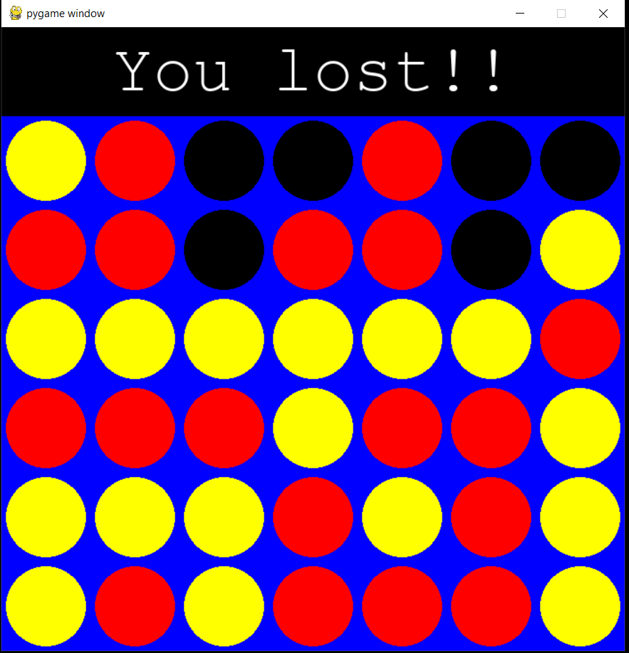
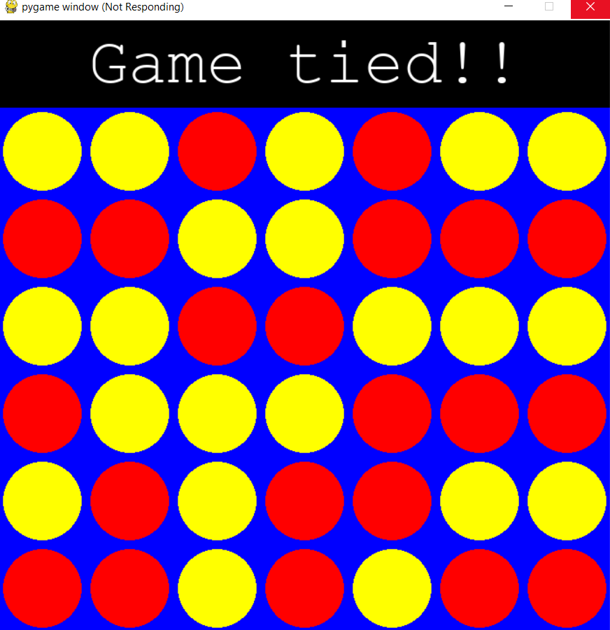

# Connect4-AI
Connect4 game playing AI using minimax algorithm

- Install dependencies using `pip install -r requirements.txt`
- All files can be run using python filename.py

easy, medium and hard use the command line interface and hard_gui uses a graphical interface made with pygame.

GUI display: 

